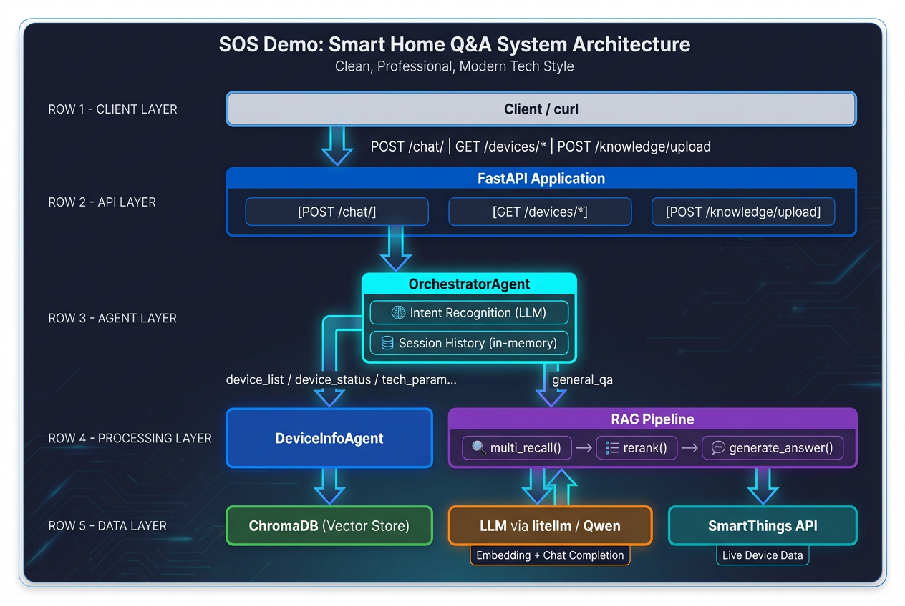
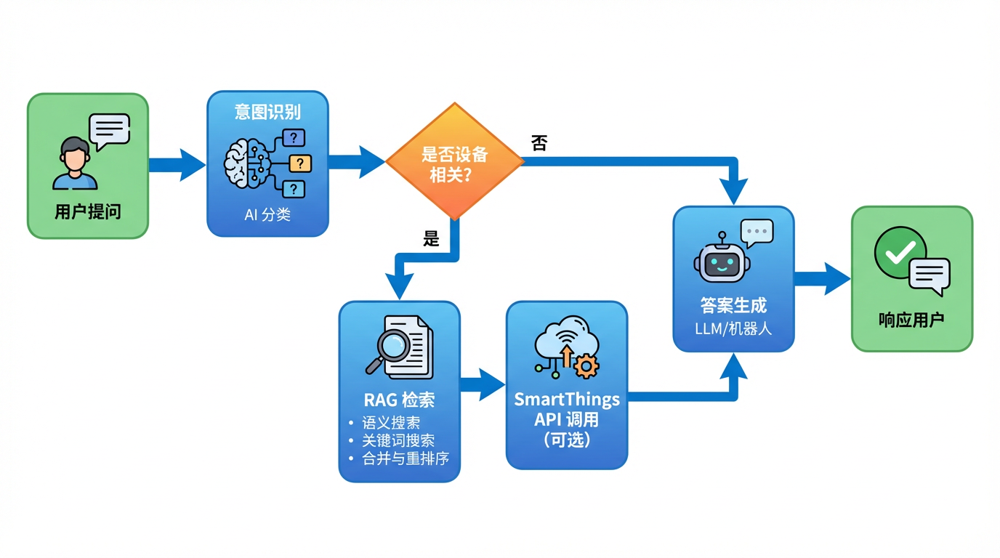

# 家电智能问答系统

基于 RAG（检索增强生成）与多 Agent 架构的智能家电问答服务，支持设备手册知识检索与 SmartThings 实时数据查询。

## 功能特性

- **智能问答**：支持设备状态、技术参数、操作指导、故障代码等多种意图识别
- **知识库管理**：PDF/Word/HTML/TXT 文档自动解析与向量化存储
- **RAG 检索**：语义搜索 + 关键词搜索多路召回，LLM 重排序优化
- **设备联动**：集成 Samsung SmartThings API，查询设备实时状态
- **多轮对话**：支持上下文理解与连续对话

---

## 快速开始

### 环境准备

```bash
# 安装虚拟环境
python3 -m venv venv

# 激活虚拟环境
source venv/bin/activate

# 安装依赖
pip install -r requirements.txt
```

### 配置环境变量

```bash
cp .env.example .env
```

编辑 `.env` 文件，配置 API 密钥：

```bash
# LLM 配置（阿里通义千问）
LLM_MODEL=openai/qwen3-max
LLM_API_KEY=sk-xxxxxxxxxxxx
LLM_BASE_URL=https://dashscope.aliyuncs.com/compatible-mode/v1

# Embedding 配置
EMBEDDING_MODEL=openai/text-embedding-v3
EMBEDDING_API_KEY=sk-xxxxxxxxxxxx
EMBEDDING_BASE_URL=https://dashscope.aliyuncs.com/compatible-mode/v1

# SmartThings API（可选）
SMARTTHINGS_TOKEN=your_pat_token_here
SMARTTHINGS_LOCATION_ID=your_location_id
```

### 启动服务

```bash
# 使用启动脚本（推荐）
./run.sh

# 或手动启动
python -m uvicorn app.main:app --host 0.0.0.0 --port 8000 --reload
```

服务启动后访问：
- API 文档：http://localhost:8000/docs
- 健康检查：http://localhost:8000/health

---

## 使用指南

### 上传设备说明书

```bash
curl -X POST http://localhost:8000/knowledge/upload \
  -F "file=@空调使用说明书.pdf" \
  -F "device_type=空调"
```

### 智能问答

```bash
curl -X POST http://localhost:8000/chat/ \
  -H "Content-Type: application/json" \
  -d '{
    "query": "空调怎么连WiFi？",
    "device_type": "空调"
  }'
```

支持的意图类型：
| 意图类型 | 示例 |
|---------|------|
| 设备状态查询 | "空调现在开着吗" |
| 技术参数查询 | "这款冰箱的容量是多少" |
| 操作步骤指导 | "怎么设置定时" |
| 故障代码解释 | "E3是什么故障" |
| 一般知识问答 | "如何清洁滤网" |

### 查询设备实时信息

```bash
# 获取设备列表
curl http://localhost:8000/devices/

# 获取设备状态
curl http://localhost:8000/devices/{device_id}/status

# 获取设备健康状态
curl http://localhost:8000/devices/{device_id}/health
```

---

## 系统架构



### 核心组件

| 组件 | 说明 |
|-----|------|
| **Orchestrator Agent** | 意图识别与请求路由 |
| **RAG Pipeline** | 多路召回、重排序、答案生成 |
| **Device Info Agent** | 设备信息查询与 SmartThings 集成 |
| **ChromaDB** | 向量数据库存储设备知识 |
| **SmartThings API** | 三星智能家居设备接口 |

---

## 请求处理流程



1. **意图识别**：Orchestrator 分析用户查询意图
2. **知识检索**：RAG Pipeline 执行语义+关键词搜索
3. **数据融合**：结合知识库与设备实时数据（如需要）
4. **答案生成**：LLM 生成结构化回答
5. **响应返回**：返回答案与引用来源

---

## 项目结构

```
kitty/
├── app/
│   ├── __init__.py
│   ├── main.py              # FastAPI 应用入口
│   ├── config.py            # 配置管理
│   ├── models/
│   │   ├── __init__.py
│   │   └── schemas.py       # 数据模型
│   ├── routers/
│   │   ├── __init__.py
│   │   ├── chat.py          # 问答接口
│   │   ├── devices.py       # 设备管理接口
│   │   └── knowledge.py     # 知识库接口
│   ├── agents/
│   │   ├── __init__.py
│   │   ├── orchestrator.py  # 意图识别与路由
│   │   └── device_info.py   # 设备信息 Agent
│   ├── rag/
│   │   ├── __init__.py
│   │   ├── llm.py           # LLM 封装
│   │   ├── retriever.py     # 检索器
│   │   ├── reranker.py      # 重排序
│   │   └── generator.py     # 答案生成
│   ├── knowledge/
│   │   ├── __init__.py
│   │   ├── parser.py        # 文档解析
│   │   ├── processor.py     # 文本处理
│   │   └── vectorstore.py   # 向量存储
│   └── api/
│       ├── __init__.py
│       └── smartthings.py   # SmartThings API 客户端
├── tests/                   # 测试目录
├── docs/                    # 文档目录
├── data/                    # 数据目录（向量存储等）
├── web-chat/                # 前端聊天界面
├── requirements.txt         # Python 依赖
├── run.sh                   # 启动脚本
├── .env.example             # 环境变量示例
├── AGENTS.md                # Agent 开发指南
└── README.md                # 项目说明
```

---

## 技术栈

- **Web 框架**：FastAPI
- **LLM**：通义千问（via LiteLLM）
- **向量数据库**：ChromaDB
- **文档处理**：LangChain
- **HTTP 客户端**：httpx

---

